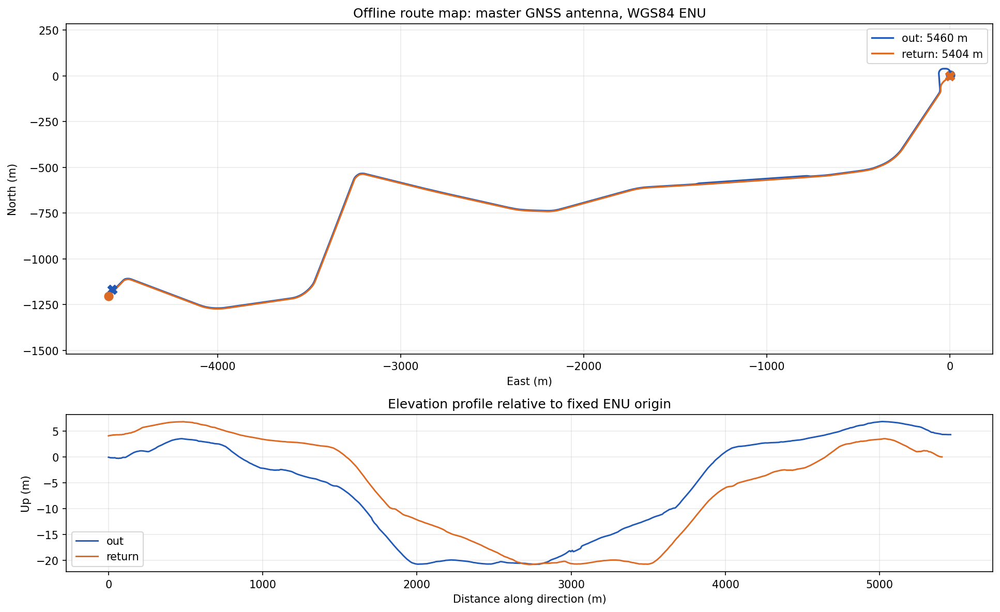

# Офлайн-карта маршрута для резервной одометрии

## Назначение и границы

`ros2_ws/src/tram_odometry/assets/route_map.csv` — компактная 3D-геометрия
**траектории антенны GNSS master**. Карта создана заранее из обучающих bag.
Основной CSV идёт по западной ветке B. Необязательный
`route_map_branch_a.csv` сохраняет ту же схему и обратный путь, но ведёт
исходящий путь по западной ветке A.
Бортовой оцениватель читает готовый CSV, получает только разрешённые колесные
скорости и положение контроллера; GNSS допустим лишь для начальной выставки.
В тестовых прогонах карта не строится и не обновляется.

В дополнительном официальном ответе организаторов уточнено: жюри ждёт
`base_link` в числовой MGRS-системе фиксированного 100-км квадрата `CB`.
Относительно `base_link` антенна master расположена по X на **−9,873 м** и по
Z на **+3 м**; rover расположен по X на **+2,563 м** и Z на **+3 м**.
Значит, ROS-нода переносит точку карты вперёд на 9,873 м по единичной
трёхмерной касательной в текущем `s` и вниз на 3 м, затем переводит ENU в
фиксированный кадр CB. Это жёсткое преобразование корпуса, без сдвига
`s` на 9,873 м по кривой траектории.
Карта при этом остаётся ENU.

## Разделение данных без утечки

`tools/make_split.py` формирует `tools/split_manifest.json` по каталогу
`analysis/catalog/bags.csv`. Одинаковые SQLite bag объединены по SHA-256, а
вся дата записи конкретного трамвая отнесена к одному набору:

| Набор | Сессии | Уникальные bag |
| --- | --- | ---: |
| train | 30618: 27 июля, 3 сентября; 30639: 26 августа | 42 |
| validation | 30618: 26 августа | 13 |
| holdout | 30618: 10 августа; 30639: 5 мая | 42 |

Карта использует восемь **только обучающих** полных прогонов 30618 от 27 июля:
четыре в каждом направлении. Западная конечная имеет две рельсовые ветки с
расхождением примерно на 60 м. Среди 19 длинных исходящих обучающих записей
как минимум четыре доходят до ветки A, а ветка B преобладает; часть записей
заканчивается до конечной. Поэтому карта `out` берёт ветку B за опорную;
точки ветки A после расхождения не усредняются с B.
Список и диагностические показатели записаны в
`route_map_meta.json`. Отложенные bag не используются для выбора координат
узлов. `tools/map_startup_audit.py` и `tools/map_position_audit.py` читают их
только после сборки карты для диагностической оценки. Поскольку аудит старта
уже показал проблему выбора направления, точность последующей эвристики на этих
же bag нельзя представлять как полностью независимый конкурсный результат.

## Координаты и формат

Внутреннее начало WGS84 ENU: `lon=37.462266845°`, `lat=55.810367065°`,
`alt=168.3794 м`; это первый master fix bag `30618_01f73500`, выбранный при
исследовательском аудите. Преобразование строгое: WGS84 geodetic `EPSG:4979`
→ ECEF `EPSG:4978` → вращение ECEF в East/North/Up. Аналитическая реализация
для проверки находится в `tools/route_map_io.py`; ROS-нода должна использовать
те же константы.

Числовой кадр `CB` получается из UTM zone 37N `EPSG:32637`:
`x = easting − 300000 м`, `y = northing − 6100000 м`. Предоставленный
организаторами пример `lon=37.4602768500852°`, `lat=55.8088325462547°`
даёт `x=103501.6309 м`, `y=85876.1201 м`. Это воспроизводит
`py -3.12 tools/route_map_io.py`. Высота после переноса master→base_link
идёт отдельным `z`; геодезический датум исходных GNSS-фиксов не подтверждён
отдельной метаинформацией.

CSV в UTF-8 имеет ровно пять колонок:



```csv
direction,s,x,y,z
out,0.000,2.124,4.250,-0.034
out,2.000,2.805,6.129,-0.042
```

- `out`: восточная конечная → западная, `s=0` у восточной конечной; длина
  5460 м.
- `return`: западная конечная → восточная, `s=0` у западной конечной; длина
  5404 м.
- Шаг `s` — 2 м. `x/y/z` — метры East/North/Up, целевая точка master GNSS.
  CSV занимает 218176 байт и содержит 5434 узла в двух направлениях.

Карта A имеет исходящий путь длиной 5516 м. Для неё есть отдельный
`route_map_branch_a_meta.json`. Если диспетчерская система знает ветку,
можно передать путь к файлу через параметр ROS `map_file` и явно выставить
`route_direction=out`. Например, при запуске ноды напрямую:

```bash
MAP_A="$(ros2 pkg prefix tram_odometry)/share/tram_odometry/assets/route_map_branch_a.csv"
ros2 run tram_odometry odometry_node --ros-args \
  --params-file "$(ros2 pkg prefix tram_odometry)/share/tram_odometry/config/default.yaml" \
  -p map_file:="$MAP_A" -p route_direction:=out -p use_sim_time:=true
```

Положение стрелки невозможно надёжно вывести из трёх входных сигналов:
контроллер и скорости колёс одинаковы на обеих ветках. Выбор ветки требует
внешнего маршрутного задания; GNSS из проверочного прогона для этого не
используется. Если ветка неизвестна, основная карта B служит априорной
гипотезой, а ковариация положения в районе развилки должна отражать
неоднозначность.

После инициализации координата обновляется как `s(t+dt)=s(t)+v(t)·dt`.
Позиция — линейная интерполяция `p(s,direction)` между соседними узлами; за
границами карты координата зажимается к крайнему узлу и выставляется
диагностический статус. Карта не меняет оценку скорости.

## Алгоритм построения

1. Оставить конечные `NavSatFix`, где master/rover по близким меткам расходятся
   на 9–16 м. Это отсекает большинство одиночных GNSS-срывов: две антенны
   физически разнесены примерно на 12,44 м. Удалить одиночные отклонения master
   более 3 м от медианы девяти соседних точек и скорости GNSS выше 20 м/с.
2. Принять скорость GNSS менее 0,1 м/с за остановку. Интегрировать норму
   трёхмерного вектора GNSS-скорости трапециями, получив метрическую продольную
   координату, не растущую от джиттера неподвижной GNSS-позиции.
3. В каждом 0,5-метровом интервале координаты взять медиану позиции,
   интерполировать опорный полный прогон с шагом 2 м и сгладить на масштабе
   нескольких метров. Разные направления строятся раздельно: на общем участке
   встречные рельсы разнесены примерно на 3,8 м.
4. Остальные три прогона каждого направления спроецировать на опорную линию;
   проверять локальное направление касательной, коридор до 5 м и продольное
   согласование. В каждом узле взять медиану согласованных позиций. Одна
   длинная остановка не получает больший вес, чем другой прогон.
5. После слияния пересчитать `s` как геометрическую длину готовой 3D-линии и
   повторно выбрать узлы через 2 м. Это устраняет локальное растяжение от
   кратких провалов GNSS-скорости; каждый линейный сегмент карты не длиннее
   соответствующего приращения `s`.

Полилинии после слияния имеют геометрическую длину около 5461 и 5405 м,
соответственно, против интеграла опорной GNSS-скорости 5465 и 5407 м.
Разница мала относительно общей длины; выбранная координата `s` соответствует
метрической дистанции по пути, а не числу GNSS-точек.

## Выставка в начале прогона

Если доступен разрешённый стартовый master GNSS fix, перевести его в тот же
ENU и проецировать на выбранный маршрут, чтобы получить `s₀`. По первым трём
позициям **нельзя** надёжно выбирать направление только по ближайшей линии:
на 16 полных отложенных прогонах такой способ дал 13 правильных направлений.
Восточный старт полного маршрута соответствует `out`, западный — `return`;
для стартов посередине использовать заданное направление или курс из начального
GNSS, если он присутствует в разрешённом окне. После выставки направление
фиксируется. Без стартового GNSS нужны явные `direction` и `s₀`; иначе
абсолютное место по трём скалярным входам не наблюдаемо.

Геометрия карты проверена на восьми полных обучающих прогонах второго
трамвая 30639: медианное поперечное отклонение на основном маршруте
0,47–0,78 м. Отдельная карта для него пока не обоснована. Проверка
антенн двух трамваев на обучающих прогонах дала медиану косинуса между
направлением master→rover и касательной движения около 0,99997 в обе
стороны; знак жёсткого переноса одинаков на `out` и `return`.

Западная конечная имеет несколько вариантов стартовой линии: в отложенных
прогонах начальная точка может быть на 20–36 м в стороне от единственного
шаблона `return`. Опциональная плавно затухающая поправка от начального GNSS
якоря уменьшает ошибку в первые метры, но заменять ею реальную ветвящуюся
карту без отдельной проверки нельзя. Ветка A для движения `out` поддержана
отдельным CSV, который требует задания ветки извне. Для всех вариантов
движения по депо карта пока не построена.

## Сравнение веток без смешивания наборов

В обучающих записях, дошедших до западного участка и прошедших фильтр двух
антенн, по конечным 20 GNSS-точкам четыре явно относятся к A, шесть — к B,
шесть заканчиваются слишком рано или близко к общей линии для надёжной
классификации (разница менее 5 м). Это подтверждает наличие двух настоящих
веток и запрещает усреднять их координаты.

После заморозки обеих карт проведена отдельная проверка на семи полных
исходящих validation bag. Скорость в обоих вариантах выдаёт один и тот же
каузальный C++-оцениватель; GNSS используется только для стартового якоря и
офлайн-ошибки приближённого `base_link`:

| Карта | Медиана RMSE положения 3D | Медиана ошибки в конце |
| --- | ---: | ---: |
| Основная B | 3,735 м | 3,136 м |
| Необязательная A | 3,815 м | 20,924 м |

На bag `30618_a869780d` результат обратный: ошибка в конце 28,40 м для B
и 6,16 м для A. Поэтому A имеет практический смысл только при известном
маршрутном задании. Числа — прокси по исходным антеннам и заданному TF;
финальный эталон жюри — отдельная объединённая локализация, не записанная в
этих bag. Подробности: `tools/branch_geometry_compare.json` и
`tools/branch_position_compare_validation.json`.

## Повторение и проверка

```powershell
py -3.12 tools/make_split.py
py -3.12 tools/map_builder.py
py -3.12 tools/map_startup_audit.py
py -3.12 tools/map_position_audit.py
py -3.12 tools/antenna_orientation_audit.py
py -3.12 tools/route_map_io.py
py -3.12 tools/train_vehicle_geometry_audit.py
py -3.12 tools/branch_geometry_compare.py
py -3.12 tools/branch_position_compare.py
```

Нужны распакованные `dataset/data/*/*.db3`, NumPy, SciPy, pyproj, Matplotlib.
Зависимости нужны **только для офлайн-сборки**. Готовый ROS-пакет использует
включённый CSV и должен собираться без Python-пакетов карты и без интернета.
Файл `tools/map_startup_audit.json` содержит покомпонентную проверку выбора
направления по первым трём fix; `tools/map_position_audit.json` отдельно
показывает ошибку геометрии при идеальной GNSS-скорости. Это диагностические
числа, не оценка точности конкурсного оценивателя и не метрика жюри.
