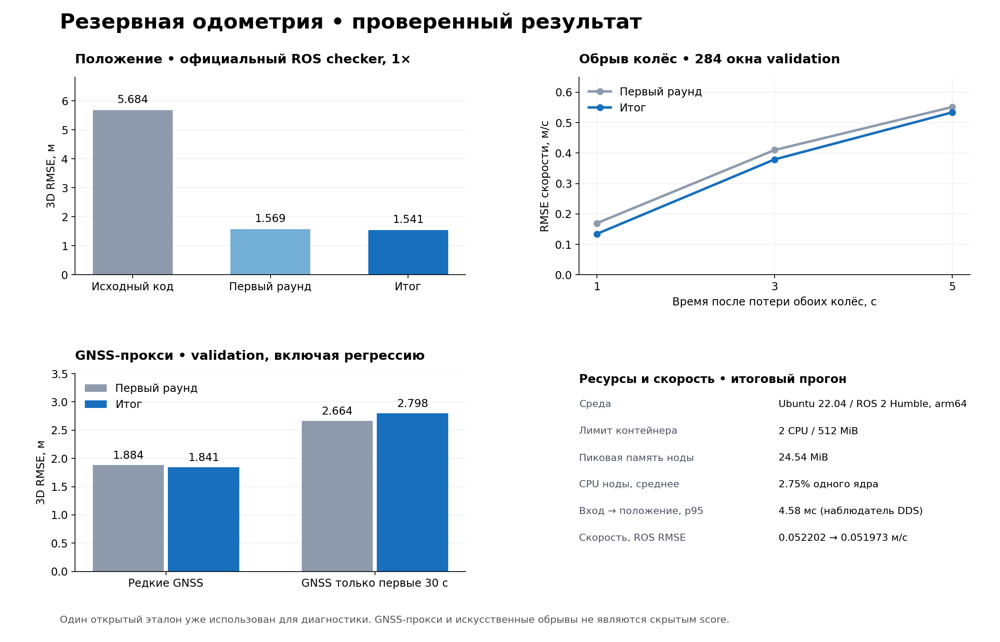

# Проверенные результаты — 27 сентября 2026

**Новая добавка после измеренной версии `8164061`:** каузальная привязка по
train-only каталогу остановок. На 13 validation bag с GNSS только первые
1,5 с pooled 3D GNSS-proxy RMSE **3,07993→2,64424 м** на одинаковых
301 243 метках; 8 bag улучшились, 3 ухудшились, 2 не изменились. Средняя
ошибка конца слегка выросла 5,11393→5,34843 м. Скорость не меняется.
При редких поздних GNSS на тех же bag выигрыш меньше: pooled RMSE
1,84099→1,83627 м. Это подтверждает, что каталог полезнее именно при
длительном отсутствии внешней коррекции.
Полный протокол и ограничения — [STOP_LANDMARKS_2026-09-27.md](STOP_LANDMARKS_2026-09-27.md).
Эта цифра не заменяет официальный ROS checker для предыдущей версии ниже.
Обзор идей других команд: [COMPETITOR_REVIEW_2026-09-27.md](COMPETITOR_REVIEW_2026-09-27.md).

Актуальный раунд, 12 экспериментов и решения: [ROUND4_EXPERIMENTS.md](ROUND4_EXPERIMENTS.md).
Числа прежних раундов ниже сохранены со своими версиями и протоколами.

Текущий runtime `8164061`: исправлена геометрия старта по rover; прежний
продольный оцениватель сохранён. Новый полный официальный ROS 1×:
3D RMSE **1,561536 м**, скорость **0,051795 м/с**. Пройдены **19 C++ / 40 Python**,
19 тестов Ubuntu/ROS и сборка исходников из архива. На фиксированном offline replay
точность прежняя: **1,544901 м / 0,048048 м/с**. Все 12 экспериментальных
вариантов, их выигрыши и ухудшения — в отчёте раунда 4 выше.

## Исторические результаты второго раунда

Версия второго раунда уменьшила официальный 3D RMSE относительно исходного кода
**5,68429→1,54089 м (72,9%)**.
Относительно первого раунда улучшение положения — **1,8%**. Дополнительно
улучшены короткие обрывы обоих колёс, защита от общего скачка и геометрия кузова.
Скорость на открытом эталоне практически не изменилась; её результат и
регрессии на отдельных сценариях приведены ниже.

Это проверка на **одном открытом** bag `30618_88aea4d9`, уже использованном
для диагностики. Она не является результатом скрытого теста организаторов.
[Протокол](VALIDATION_PROTOCOL.md), [эксперименты и решения](ROUND2_IMPROVEMENTS.md),
[сохранённый отчёт первого раунда](RESULTS_ROUND1.md).

Полные таблицы улучшений, регрессий и отдельных измерений: [METRICS_COMPARISON.md](METRICS_COMPARISON.md).
Результаты ниже получены на версии `e248a96` до объединения с аудитом
сокомандника `a9ad10c`. Проверки объединённой версии фиксируются отдельно в
[PUBLISH_VERIFICATION.md](PUBLISH_VERIFICATION.md).
Последующее исправление совместного зависания колёс, его синтетический
выигрыш и побайтная сверка всех 97 исторических bag приведены в
[PAIR_FREEZE_AUDIT_2026-09-27.md](PAIR_FREEZE_AUDIT_2026-09-27.md).
Официальные числа ниже не переименовываются в новые измерения: полный
ROS checker после этого исправления не повторялся.

## Официальный ROS checker

Три полных прогона при **1×**, Ubuntu 22.04 / ROS 2 Humble, arm64, Docker,
**2 CPU / 512 MiB**. Официальный checker использует ATS: очередь 100,
допуск 50 мс, исходные метки и XYZ без подгонки. Все прогоны завершены штатно.

| Метрика | Исходный код | Первый раунд | Итог |
|---|---:|---:|---:|
| 3D RMSE, м | 5,68429 | 1,56918 | **1,54089** |
| Максимальная 3D ошибка, м | 47,82773 | 11,39976 | 11,30611 |
| RMSE скорости, м/с | 0,052052 | 0,052202 | 0,051973 |
| Пар положения | 27804 | 27419 | 28531 |
| Пар скорости | 27804 | 27419 | 28531 |

Число пар может различаться из-за порядка DDS callback/ATS. Дополнительное
офлайн-сравнение реально записанных выходов на **26850 общих метках**
подтверждает изменение 3D RMSE первого раунда→итог:
**1,56788→1,52168 м**.
Это отдельный метод ближайшего эталона, не замена ATS.
На этой общей маске RMSE скорости слегка вырос 0,048807→0,048982 м/с;
малую разницу официального ATS не считаем устойчивым улучшением скорости.
[Общая маска двух раундов](../evaluation/results/round2_final/ros_round1_vs_round2_common.json),
[исходный код→итог на общей маске](../evaluation/results/round2_final/ros_original_vs_round2_common.json).

Recorder сохранил все 65 579 эталонных сообщений. Coverage checker относительно
записанных выходов: положение **99,979%**,
скорость **99,958%**.
Ошибка конца по ближайшей эталонной метке итоговой ROS-записи —
**0,1151 м**; у исходного кода было 47,7417 м.
Первые выходы положения удерживаются до выбора абсолютного/относительного кадра;
задним числом сообщения не дописываются.

Источники: [исходный прогон](../evaluation/results/ros_original_1x_run_summary.json),
[первый раунд](../evaluation/results/ros_final_1x_run_summary.json),
[итоговый прогон и ресурсы](../evaluation/results/round2_final/ros_run_summary.json),
[метрики записанных выходов](../evaluation/results/round2_final/ros_offline_metrics.json).

## Ресурсы и контракт

| Измерение итоговой ноды | Результат |
|---|---:|
| Средняя частота положения по заголовкам | 21,75 Гц |
| Максимальный интервал положения | 0,144 с |
| Пиковая память RSS/VmHWM | 24,54 MiB |
| CPU, среднее / p95 одного ядра | 2,75% / 5,49% |
| Вход→скорость, p50 / p95 / max | 1,22 / 4,11 / 28,87 мс |
| Вход→положение, p50 / p95 / max | 1,81 / 4,58 / 29,18 мс |
| Охват измерения задержки положения | 100,00% |

CPU/RSS относятся к процессу ноды. Задержка измерена независимым наблюдателем
от получения C/F/R до результата с той же header-меткой, включая DDS и
планирование этого стенда. Это не аппаратная задержка датчика. Пиковый
межкадровый интервал и задержка обработки — разные величины.

**13/13 C++ наборов**, **37/37 Python-тестов**, ASan/UBSan и 13 ROS CTest прошли.
Дополнительные короткие ROS-прогоны: [движение без GNSS](../evaluation/results/round2_final/ros_contract_no_gnss.json)
и [конфигурация 30639](../evaluation/results/round2_final/ros_contract_30639.json).
[Проверки и хэши](../evaluation/results/round2_final/verification.json).

## Обрыв двух колёс и штатная скорость

284 одинаковых validation-окна, удаление обоих колёс на 5,12 с, одинаковые
причинные метки сравнения. GNSS используется только оценщиком.

| Горизонт | RMSE скорости до→после, м/с | RMSE пути до→после, м |
|---|---:|---:|
| 1 с | 0,169680→**0,134484** | 0,093979→**0,076536** |
| 3 с | 0,410095→**0,379171** | 0,665689→**0,577486** |
| 5 с | 0,551532→**0,533883** | 1,597571→**1,466822** |

Все горизонты улучшились в каждой полной train-сессии и обеих исторических
holdout-сессиях. Штатный validation RMSE остался около **0,033146 м/с**.
Есть малые регрессии штатной скорости: сентябрьский train 30618
0,087993→0,088133 м/с, исторический holdout 30618 — 0,121822→0,122033.
На синтетическом `trip/pair_freeze` RMSE скорости за первые 5 с после возврата
ухудшился **1,337839→4,425185 м/с**, RMSE пути за весь сценарий —
**15,716260→34,849460 м**. Это существенная известная регрессия, а не
подтверждение общей победы над всеми отказами. Плавный общий bias также
ухудшает восстановление. Ни записи, ни окна из-за ухудшения не удалялись. Подробные результаты по всем
bag, сессиям, хэшам и сценариям: [speed_study_final.md](../evaluation/results/speed_study_final.md),
[speed_study_final.json](../evaluation/results/speed_study_final.json).

На открытом объединённом эталоне офлайн-сравнение скорости на общей маске
26 188 меток контроллера не изменилось: фильтр **0,047735 м/с**, простое
среднее колёс **0,026839 м/с**. Фильтр здесь хуже базы. На полной выходной
маске navigation replay (26 884 пары) RMSE скорости 0,048048 м/с.
Эти значения не смешиваются с официальным ATS.

## Положение: геометрия и редкие GNSS

Полный автономный replay итогового общего ядра: 3D RMSE
**1,56633→1,47492 м**, ошибка конца **0,57890→0,10075 м**.
[Абляции с одинаковым итоговым скоростным фильтром](../evaluation/results/round2_final/reference_ablation.json).

На 33 train + 13 validation bag проверены 184 сценария с общими масками.
Редкие GNSS улучшили все **13/13 validation**: pooled 3D RMSE
**1,88445→1,84099 м**, медиана по bag **1,49716→1,46177 м**.
При замороженных поздних GNSS: 1,79545→1,75257 м. При отсутствии GNSS после
первых 30 с pooled RMSE **ухудшился 2,66405→2,79814 м**, хотя 9/13 bag
улучшились. Исправление геометрии убрало случайную компенсацию последующего
дрейфа на нескольких поездках; параметры под них не менялись.
[Полный совместный отчёт](../evaluation/results/round2_final/navigation_train_validation.json).

Два off-map train bag остаются в относительном `odom` и не имеют абсолютного
RMSE; это отдельно снижает coverage. Paired-GNSS прокси старого датасета
не считается объединённым эталоном организаторов.

## Ограничения результата

- **Мало независимых сессий:** 42 train / 13 validation / 42 исторических holdout
  после удаления дубликатов; у 30618 две train-даты и одна validation-дата.
  Holdout уже участвовал в прежнем выборе модели; открытый эталон исследован.
- Общая плавная ошибка колёс может быть неотличима от движения. Продолжительный
  общий скачок при растущей неопределённости может быть принят как tentative.
- Физическая база GNSS не обнаруживает общий сдвиг пары и не работает при
  единственной антенне. Плохой lone-rover fix остаётся известным ограничением.
- Без новых достоверных координат на развилке правильная ветка не гарантирована.
  Очень тесные кривые и концы карты ограничивают приближение ориентации кузова.
- Один 22-минутный прогон arm64 не заменяет многочасовое испытание на машине жюри.
  Синтетические отказы не являются официальным robustness-score.

Технический комплект: [SUBMISSION_CHECKLIST.md](SUBMISSION_CHECKLIST.md).

## Исторический аудит исходной версии

[VALIDATION_AUDIT.md](VALIDATION_AUDIT.md) и `evaluation/*_deployed.csv`
сохраняют независимый аудит сокомандника до двух раундов улучшений.
Они показывают риск выбора режима по уже просмотренному holdout и общий
масштабный дрейф на майской сессии 30639. Это ограничения обобщения, а не
метрики итогового Navigation. Включение таблицы только для 30618 сохранено.
20-минутный ROS replay 30639 из аудита также относится к прежней реализации;
его GNSS-прокси 38,11 м нельзя напрямую сравнивать с официальным эталоном 30618.
