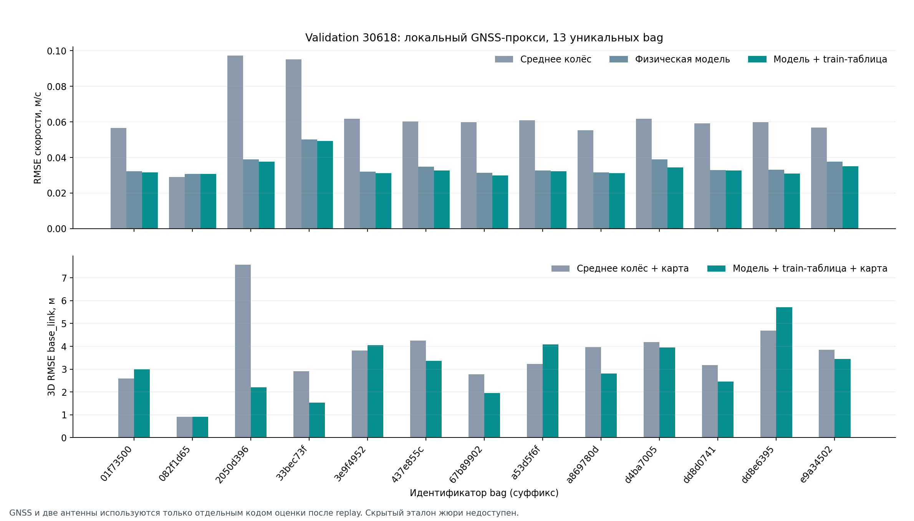

# Локальная проверка и измерения

## Методика

Разделение `tools/split_manifest.json` сделано по целым сессиям каждого трамвая, а идентичные SQLite-файлы по SHA-256 помещены в один набор: 42 train, 13 validation, 42 holdout. Колесные масштабы, нелинейная таблица привода и геометрия маршрута получены только из train. Полный C++ оцениватель воспроизводится по трём разрешённым входам в порядке получения сообщений; GNSS не передаётся в его процесс. Лишь после вычисления выходов отдельные скрипты сопоставляют их с GNSS.

**У организаторов нет отдельной безошибочной эталонной скорости.** Наш локальный прокси берёт ближайшие по времени (`≤0,05 с`) master/rover GNSS-скорости; при наличии обеих требует согласия `≤0,3 м/с` и усредняет их. При наличии одной использует её. Метрики не равны баллам жюри по скрытому объединённому эталону. Позиционный прокси дополнительно удаляет одиночные скачки GNSS, использует согласованную пару антенн и строит `base_link` по официальным TF. Эталон судьи в исходных bag отсутствует.

## Скорость

Простая причинная база — среднее свежих колесных скоростей с удержанием предыдущего значения при отсутствии обеих. Обе системы сравниваются на одинаковых метках команд контроллера.

| Набор | Bag с GNSS-прокси | Сопоставленных отсчётов | RMSE базы, м/с | Физическая модель | Финальный режим, м/с |
| --- | ---: | ---: | ---: | ---: | ---: |
| validation | 13 | 286 515 | 0,0672 | 0,0359 | **0,0345** |
| holdout | 23 | 431 768 | 0,1241 | 0,1198 | **0,1192** |

Финальный режим включает train-only таблицу ускорений для `30618`, а для `30639` оставляет физическую модель. Источники: `evaluation/validation_core_rawfreeze_fix.csv`, `evaluation/validation_core_table_optional.csv`, `evaluation/holdout_core_rawfreeze_fix.csv`, `evaluation/holdout_core_table_optional.csv`; строка holdout объединяет соответствующие режимы по `vehicle_id`. Выбор включения таблицы основан на независимой validation 30618 и затем проверен на holdout. После выбора режима этот holdout уже не является строгим untouched тестом гиперпараметров.

В holdout встречается длительное зависание rear=0 и ошибочные метки времени. Сравнение неизменного **сырого** отсчёта до компенсации возраста сообщения исправило диагностированную ошибку фильтра: на bag `30639_3b3d9eb8` RMSE модели снизился с 1,53 до 0,225 м/с. Защита проверена синтетическим C++ regression test с меняющимся лагом сообщений. Исправление не подбиралось по числам holdout.

## Интеграл пути и 3D-положение

Для продольного дрейфа интегрированы скорость и GNSS-прокси на одинаковых интервалах с исправными измерениями (`dt≤0,15 с`). Это **оценка по GNSS-скорости**, а не ошибка относительно истинной длины рельса или закрытой эталонной траектории.

| Набор | Bag с достаточной GNSS-скоростью | Медиана абсолютного конечного дрейфа базы | Физическая модель | Финальный режим |
| --- | ---: | ---: | ---: | ---: |
| validation | 12 | 0,233% | 0,226% | **0,188%** |
| holdout | 21 | **0,340%** | 0,664% | 0,664% |

Источники: `evaluation/validation_distance_rawfreeze_fix.csv`, `evaluation/holdout_distance_rawfreeze_fix.csv`. В holdout 30639 проходит в другой дате с заметно иным общим масштабом колесной/GNSS-скорости, чем обучающая сессия. Добавка train-калибровки `+0,3%` улучшает train, но ухудшает дистанцию на этом holdout. По двум скалярным колесным скоростям без внешнего эталона постоянный общий масштаб в поездке не наблюдаем. Коэффициент **не подбирался** по holdout; этот риск важен для дальнейшей работы.

Для 3D-прокси на validation карта линии построена из train, якорь получен из первых трёх master GNSS-fix, далее используются только колёса и контроллер. Отдельные master/rover позиции после старта читаются лишь оценочным скриптом, чтобы получить приближённое `base_link`. После выбора **более частой западной ветки по train** и включения таблицы привода на 13 validation bag медианная 3D RMSE `base_link` равна **2,99 м** против 3,82 м у базы. Медианная ошибка конца прогона — **3,33 м** против 4,31 м. Источники: `evaluation/validation_position_proxy.csv`, `evaluation/validation_position_table.csv`. Меньшинство поездок заканчивается на другой ветке, что по трём входам перед развилкой не различается. Эти числа не следует выдавать за скрытый score жюри: их система объединённой локализации отсутствует в выданных bag.

На 20 holdout bag с пригодными GNSS-позициями тот же прокси показывает неоднородность между трамваями: у `30618` медианная 3D RMSE `base_link` 4,32 м против 5,29 м у базы (11 bag), у `30639` — 43,28 м против 34,28 м (9 bag). Для майской сессии `30639` общий масштаб колёс и GNSS отличается от августовского train; иногда наблюдается и смещение GNSS-траектории на отдельных участках. Это **существенное ограничение**, требующее независимого способа продольной коррекции или новой калибровочной сессии. Источник: `evaluation/holdout_position_deployed_proxy.csv`. Он использует таблицу только для `30618`, как ROS-нода.

## Потеря обеих тележек

Train-only эмпирическая зависимость ускорения от позиции контроллера и скорости хранится в `assets/drive_accel_table.csv`. Она отражает немонотонность реального управления: позиция `−8` при 3–8 м/с часто близка к выбегу, тогда как `−7` даёт около `−0,8 м/с²`. На 284 искусственных пятисекундных обрывах обоих колесных каналов в 12 validation bag **точный C++ оцениватель** с таблицей дал RMSE скорости 0,555 м/с против 0,672 м/с у физической модели; RMSE пути 1,620 против 1,915 м. Включение ограничено поддержанными train-клетками и трамваем `30618`; условия и неопределённость приведены в `docs/DRIVE_CALIBRATION.md`.

## Производительность и статус ROS

`evaluation/runtime_smoke.py` с включённой таблицей измерил отдельный C++ replay на bag `30618_2050d396`: 51 904 входных сообщения и 26 807 выводов за медианные 0,607 с, тогда как запись длится 1 343 с. Это ~85 600 входных событий/с, включая текстовые stdin/stdout CLI. Измерение показывает вычислительный запас ядра, **не** задержку подписка→публикация ROS.

Автономные C++ тесты оценивателя, проекции MGRS и смещения антенн пройдены. В Ubuntu 22.04 с ROS 2 Humble на WSL выполнен `colcon build --packages-up-to tram_odometry`: оба пакета собраны. Автоматические replay на реальных bag проверили типы топиков, `header.stamp`, кадры, конечность чисел, частоту и диагностику:

| Режим и bag | Velocity / position, сообщений | Частота velocity / position, Гц | p95 callback→publish, мс | Peak RSS, МиБ | p95 CPU, % одного ядра |
| --- | ---: | ---: | ---: | ---: | ---: |
| `30618_01f73500`, стартовый GNSS, движение | 467 / 465 | 21,20 / 21,11 | 0,219 | 25,28 | 7,92 |
| `30639_50956d6e`, стартовый GNSS, движение | 562 / 562 | 25,35 / 25,35 | 0,198 | 25,22 | 6,67 |
| `30618_2050d396`, только три разрешённых входа | 650 / 575 | 29,40 / 29,66 | 0,188 | — | — |
| `30618_af7496f0`, полный движущийся bag, 263 с | 5313 / 5312 | 20,21 / 20,21 | 0,205 | 25,12 | 4,00 |
| `30618_af7496f0`, повторный полный bag с записью чисел | 5312 / 5308 | 20,21 / 20,19 | 0,215 | 25,13 | 4,00 |

Абсолютные прогоны дали `frame_id=mgrs_37UCB` и начальную привязку от master GNSS; их x/y/z менялись при движении. Без GNSS после окна инициализации опубликован `frame_id=odom`. Все тесты прошли без ошибок типов, штампов и чисел. [JSON-отчёты и логи](../evaluation/ros_smoke) получены скриптом `tools/ros_smoke_wsl.sh`; приведённые CPU/RSS — отсчёты `/proc` по процессу ноды. `callback_to_position_publish_ms` измеряет только участок **от входа в callback до вызова публикации внутри ноды**, а не полную задержку датчик→DDS→потребитель. [Полный bag-отчёт](../evaluation/ros_smoke/anchored_20260926_232018_2DFf/report.json) за 263 с содержит p50/p95/p99/max callback→publish **0,125/0,205/0,310/0,913 мс** и 5313/5312 выходов при средней частоте выше 20 Гц; полноценный ресурсный тест на многочасовом replay остаётся следующим этапом.

Повторный движущийся 25-секундный прогон `30618_01f73500` сохранил [отдельный отчёт](../evaluation/ros_smoke/anchored_20260926_231625_pnTr/report.json): частота 20,69/20,51 Гц, задержка callback→publish p50/p95/p99/max = **0,128/0,225/0,370/0,871 мс**, пик RSS 25,24 МиБ. Эти цифры относятся к короткому WSL-прогону и не доказывают пик при длительной работе или полную задержку DDS.

Повторный полный replay `30618_af7496f0` через **настоящую ROS-ноду** записал каждое `/result/velocity` и `/result/position` в [samples.csv](../evaluation/ros_smoke/anchored_20260926_233338_Uhja/samples.csv). [Отчёт ROS](../evaluation/ros_smoke/anchored_20260926_233338_Uhja/report.json) и [поштучное сравнение](../evaluation/ros_smoke/anchored_20260926_233338_Uhja/accuracy.json) показывают: на **5257 совпадающих метках** RMSE скорости ROS относительно отдельного C++ CLI — **0,00273 м/с** (p95 абсолютного расхождения 0,00562, максимум 0,0201 м/с). ROS относительно GNSS-прокси имеет RMSE **0,17481 м/с** на 5307 метках; автономный CLI на пересечении его меток с ROS и доступным GNSS — **0,17500 м/с** на 5253 метках. Числа различаются из-за обработки событий в ROS callback и более редких публикаций автономного CLI, но практически подтверждают офлайн-оценку скорости. Нода также выдала 5308 точек положения; на 5206 метках их 3D RMSE относительно отфильтрованной пары GNSS, приведённой к `base_link` по официальным TF, составила **5,98 м**. Это один holdout bag и доступный GNSS-прокси, поэтому число не обобщается на все поездки и не является закрытой метрикой судьи. Сравнение воспроизводится `evaluation/compare_ros_replay.py`; процедура записи есть в [инструкции жюри](JURY_CHECK.md).

## Ограничения и следующий этап

1. **Абсолютное положение при отсутствии стартового GNSS.** По трём скалярным каналам невозможно восстановить мировой x/y и выбрать стрелку пути. Сейчас выдаётся относительная одометрия. Для гарантированного MGRS нужны стартовая поза из основного контура либо диспетчерская информация о пути.
2. **Общий масштаб скорости в другой сессии.** Майские bag `30639` показывают заметный сдвиг относительно августовской train-калибровки. Следующий шаг — независимые маршрутные landmarks, известные станции/остановки или безопасная периодическая привязка к основному контуру, когда он доступен. Подгонять коэффициент по скрытому тесту нельзя.
3. **Разветвление у западной конечной.** Две train-only карты уже приложены. Для автоматического выбора ветки нужен сигнал стрелки или метка пути; до его появления B — априорно более частый вариант по train, а ковариация должна предупреждать о неразличимой ветке.
4. **Физика торможения.** Позиции `−8` и `−15` имеют неоднозначные режимы. Нужны данные фактического тока/момента, массы, уклона и состояния тормозов для более долгого прогноза при пропаже обеих тележек. Таблица покрывает лишь поддержанные клетки и при неопределённости отступает к физической модели.
5. **Интеграция.** Сборка, короткие прогоны и один полный 263-секундный bag пройдены. Для финальной надёжности полезны многочасовой replay, проверка непрерывности при ускоренном проигрывании и сбросе времени, а также измерение полной задержки от входного DDS-сообщения до потребителя. Standalone скорость ядра и callback latency не заменяют этот тест.
