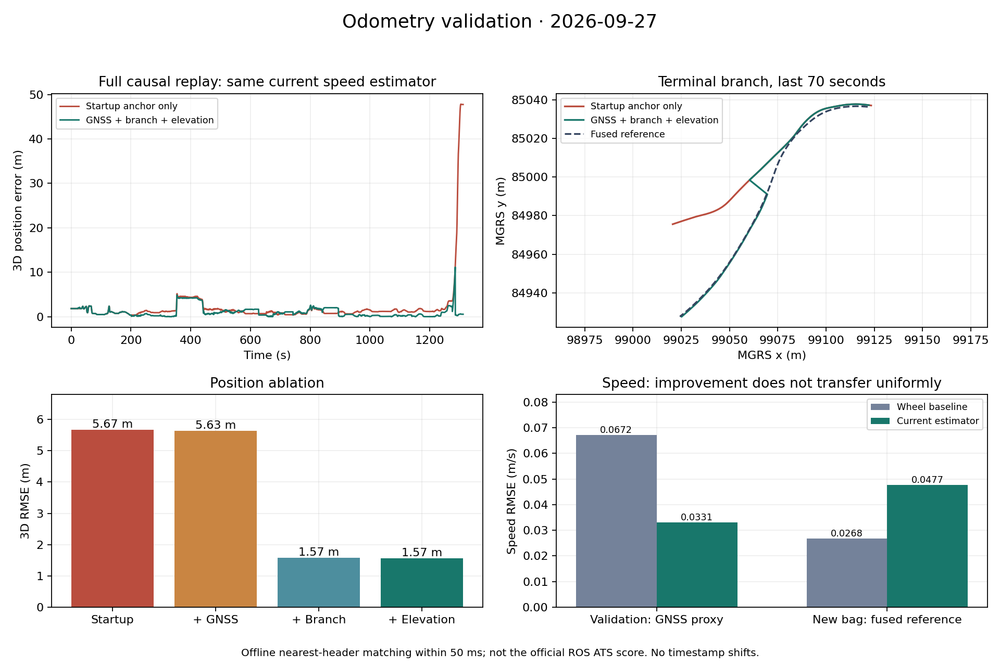

# Исторический первый раунд — 27 сентября 2026

Это сохранённый отчёт до второго раунда. Текущие результаты: [RESULTS.md](RESULTS.md).

Новая версия использует редкие разрешённые GNSS-fix для коррекции маршрутной привязки, различает две западные ветки, применяет официальную высоту base_link и сильнее доверяет здоровой согласованной паре колёс. ROS и полный автономный replay вызывают один `Navigation`/`Estimator`.

Ниже раздельно приведены объединённый эталон нового bag и GNSS-прокси старого датасета. Обновлённый [протокол валидации](VALIDATION_PROTOCOL.md) описывает временное сопоставление, утечки, coverage и происхождение данных. Старые `*_final.csv` в корне evaluation относятся к прежним экспериментам и **не подтверждают текущие итоговые числа**; актуальные отчёты находятся в `evaluation/results`.

## Новый объединённый эталон

Запись `30618_88aea4d9`: 1309,59 с, 65 579 эталонных Odometry. Никакой подгонки положения или времени по эталону не выполняется. Он читается только оценщиком. Приведённые ниже абляции используют одинаковый текущий скоростной фильтр и различаются только источниками навигации.

| Офлайн-режим | 3D RMSE, м | Ошибка конца, м |
|---|---:|---:|
| Только стартовый GNSS-якорь, прежняя ветка B | 5,6656 | 47,7417 |
| + коррекции по редким GNSS | 5,6333 | 47,7417 |
| + подтверждаемый GNSS выбор ветки A/B | 1,5734 | 0,5789 |
| + официальная высота base_link | **1,5663** | **0,5789** |

Основной выигрыш даёт правильный выбор ветки по позднему rover GNSS. До появления этой информации ветка не наблюдаема, поэтому максимальная ошибка новой версии достигает 11,42 м. Новая карта высоты улучшает Z, но почти не меняет общий RMSE. Итоговое положение сопоставлено на 26 884 метках, coverage 99,978%; отсутствующие первые точки до якоря отдельно отражены в отчёте.

Источник: [reference_ablation_20260927.json](../evaluation/results/reference_ablation_20260927.json). Это ближайший эталон в пределах 50 мс, **не официальный ROS ATS**. Для старого нетронутого кода используется отдельный реальный ROS-прогон, а не эта строка абляции с уже обновлённым фильтром скорости.

На общих 26 188 метках контроллера сравнение скорости с новым объединённым эталоном:

| Алгоритм | RMSE, м/с |
|---|---:|
| Простое причинное среднее доступных колёс | **0,02684** |
| Прежний фильтр с таблицей | 0,04911 |
| Новый фильтр с таблицей | 0,04774 |

Изменение улучшает старый фильтр, но **не обгоняет простую базу на этом эталоне**. Разница с исходным GNSS-прокси не скрывается: на редких GNSS-метках нового bag улучшение к тому же не переносится. Смещение времени результатов ради уменьшения ошибки не используется. Один открытый bag, уже изученный при исправлении интеграции, не является скрытым независимым тестом.

## Реальная ROS-проверка

Оба полных прогона завершились штатно на скорости **1×** с официальным checker: Ubuntu 22.04 / ROS 2 Humble, arm64, Docker, лимиты **2 CPU / 512 MiB**. Длительность проигрывания каждой записи — около 1309,8 с. Recorder сохранил все 65 579 эталонных сообщений; результаты ноды сопоставлены checker с coverage >99,95%.

| Официальный ROS ATS | Исходная нода | Новая нода |
|---|---:|---:|
| 3D RMSE, м | 5,68429 | **1,56918** |
| Максимальная 3D ошибка, м | 47,82773 | **11,39976** |
| RMSE скорости, м/с | **0,052052** | 0,052202 |
| Пар скорости / положения | 27 804 / 27 804 | 27 419 / 27 419 |
| Coverage положения | 99,978% | 99,978% |

Ошибка положения снизилась примерно на **72,4%**. Конечная ошибка по ближайшей эталонной метке уменьшилась **47,7417→0,5820 м**. Скорость по официальному ATS слегка ухудшилась (около 0,3%); выигрыш GNSS-validation не выдаётся за универсальное улучшение. Из-за порядка DDS callback и ATS число пар различается.

Дополнительное сравнение записанных ROS-выходов на одинаковых 26 857 метках положения даёт 3D RMSE **5,7467→1,5656 м**. Оно подтверждает выигрыш при общей маске, но остаётся отдельным офлайн-методом. [Общая маска и все компоненты](../evaluation/results/ros_before_after_common.json), [ROS и автономный replay против того же эталона](../evaluation/results/ros_vs_replay_reference.json).

Финальная нода публиковала положение в среднем **20,90 Гц** по заголовкам; максимальный межкадровый интервал **0,144 с**, повторных и обратных временных меток нет. Скорость публиковалась 27 431 раз, положение — 27 425; шесть начальных событий положения удержаны до привязки, без последующего заполнения задним числом.

| Ресурс/задержка новой ноды | Измерение |
|---|---:|
| Максимум RSS/VmHWM | **24,29 MiB** |
| CPU, среднее / p95 одного ядра | **2,17% / 4,00%** |
| Вход→скорость, p50 / p95 / max | **0,53 / 2,58 / 32,49 мс** |
| Вход→положение, p50 / p95 / max | **0,86 / 3,04 / 32,68 мс** |
| Охват измерения задержки | **100%** для обоих выходов |

Задержка измерена отдельным наблюдателем от приёма C/F/R до приёма результата с той же меткой, включая DDS и планирование в этом стенде. Это не аппаратная задержка датчика. CPU/RSS относятся только к `odometry_node`; весь контейнер дополнительно содержит проигрыватель, recorder и checker. Все процессы штатно завершились, форсированного прекращения нет.

Источники: [исходный ROS-прогон](../evaluation/results/ros_original_1x_run_summary.json), [финальный ROS-прогон и runtime](../evaluation/results/ros_final_1x_run_summary.json), [финальные офлайн-метрики записи](../evaluation/results/ros_final_1x_offline_metrics.json). Полные записи сохранены локально в `evaluation/runs/ros_original_1x` и `evaluation/runs/ros_final_1x`.

Дополнительные реальные ROS-проверки прошли: [без GNSS](../evaluation/results/ros_contract_no_gnss.json) с переходом в `odom` и [30639](../evaluation/results/ros_contract_30639.json) с его конфигурацией. **7 C++ исполняемых тестовых наборов** проходят в CTest и под AddressSanitizer/UBSan, **28 Python-тестов** проходят; [команды и сводка](../evaluation/results/verification_20260927.json).

## Старый датасет: скорость и обрывы колёс

Разбиение: 42 train /13 validation /42 исторических holdout, по целым сессиям и SHA-256 дубликатам. Все validation относятся к 30618, отдельной validation-сессии 30639 нет. Holdout ранее использовался при выборе режима таблицы и не считается полностью независимым.

| Набор/режим | Совпавшие метки | RMSE до, м/с | RMSE после, м/с |
|---|---:|---:|---:|
| Train, таблица 30618 + физика 30639 | 939 478 | 0,05980 | **0,05796** |
| Validation, физика | 286 515 | 0,03591 | **0,03387** |
| Validation, таблица 30618 | 286 515 | 0,03452 | **0,03315** |

На train улучшились 39/42bag, два не изменились, один слегка ухудшился. На validation улучшились все 13; baselinevalidation —0,0672 м/с. Порог 0,90 для согласной пары зафиксирован до проверки нового эталона. Число флагов slip/model-only не изменилось. [Подробности и воспроизведение](HEALTHY_WHEEL_GAIN_2026-09-27.md), [train](../evaluation/results/train_original.pair_gain.json), [validation](../evaluation/results/validation_original.pair_gain.json).

Повторный текущий holdout после фиксации алгоритма, с таблицей только 30618:

| Выборка | Bag с GNSS | Метки | База, м/с | Текущий фильтр, м/с |
|---|---:|---:|---:|---:|
| 30618 | 13 | 209 747 | 0,13686 | **0,12182** |
| 30639 | 10 | 222 021 | **0,11078** | 0,11421 |
| Все | 23 | 431 768 | 0,12414 | **0,11797** |

[Таблица по всем bag](../evaluation/results/holdout_current_deployed.csv), [агрегаты и хэши кода](../evaluation/results/holdout_current_summary.json). Старое утверждение 0,1192 м/с не использовано как доказательство: соответствующие ранее названные файлы отсутствовали, а имевшийся `holdout_core_final.csv` содержал другую версию результатов.

Для 284 одинаковых окон на 12validationbag искусственно удалены оба колёсных канала на 5,12 с. С таблицей RMSE скорости через 5 с уменьшился 0,55471→0,55153 м/с, ошибки пути 1,61997→1,59757 м; через 1 и 3 с также улучшился. Это тест обрыва каналов, а не доказательство обнаружения любого буксования. [До](../evaluation/results/original_blackout.json), [после](../evaluation/results/pair_gain_blackout.json).

## GNSS: независимые от эталона стресс-сценарии

Искусственно редкие двухсекундные окна GNSS, сдвинутые на 1 с окна и зависшие координаты проверены на train/validation по paired-GNSS base_link прокси. Во всех вариантах первые 30 с GNSS одинаковы, коррекции включены. Поэтому режим first30_only не равен глобальному `enable_gnss_corrections=false`.

На двух исходных validation-сценариях переход от первых 30 с к редким окнам снизил 3D RMSE2,836→1,662 м и 1,966→0,767 м. Все поздние окна дали точно тот же результат, что их отсутствие; скорость и интегрированный путь совпали побитно между сценариями. Замороженные координаты при движении по двум здоровым колёсам отбрасываются. На двух точных train поездках чистые коррекции слегка ухудшили RMSE; на одной train поездке GNSS после развилки отсутствовал, и ветка осталась неверной. [Протокол и исходные числа](../evaluation/results/navigation_gnss_stress.json).

Расширенная проверка всех **13 validation bag**, без изменения настроек: чистые редкие GNSS улучшили 11 поездок, одну не изменили, одну ухудшили. Медианный 3D RMSE снизился **2,571→1,497 м**, взвешенный по числу пар — **2,664→1,884 м**. Все 13 вариантов с задержанными окнами дали точно те же позиции, что их отсутствие; скорость и путь идентичны во всех 52 сценариях. [Полный отчёт](../evaluation/results/navigation_gnss_validation.json).

В `30618_3e9f4952` ошибка выросла **2,401→4,821 м** из-за систематически смещённых разрешённых rover-fix. На проблемном участке расстояние между исходными антеннами достигает 28,6 м при физической базе 12,436 м; статус fix остаётся 2, ковариация неизвестна, задержка нормальна. В искусственном одиночном окне вторая антенна алгоритму недоступна, поэтому согласованное смещение вдоль рельса проходит проверки. Это ограничение одиночной GNSS-коррекции, а не основание подбирать порог по одному validation bag. [Диагностика регрессии](../evaluation/results/navigation_gnss_regression_3e9.json).

## Ограничения

- Нет внешней информации после развилки — нельзя гарантировать выбор пути; последние достоверные координаты продолжаются по текущей карте.
- Одновременная плавная общая ошибка двух колёс может совпадать с допустимой динамикой. Есть защита от резких выбросов, рассогласования, застывшего одного колеса и обрывов, но полного решения общей пробуксовки нет. Согласный продолжительный скачок обоих колёс может быть принят после восстановления — известная граница старого recovery.
- Скорость по объединённому эталону нового bag всё ещё хуже простой колёсной базы. Улучшение validationGNSS не объявляется универсальным.
- Касательная траектории master лишь приближает ориентацию кузова на тесных петлях; train-проверка оценивает типичные p95 ошибки смещения base_link примерно 1,8–2,4 м в таких местах.
- Без стартового GNSS или заданного положения выход становится относительным `odom`. При полном отсутствии любых входов нет новых событий для публикации.
- CPU/RSS и DDS-задержка зависят от платформы; проверка одного 22 минутногоbag не заменяет многочасовое испытание на целевой машине.
