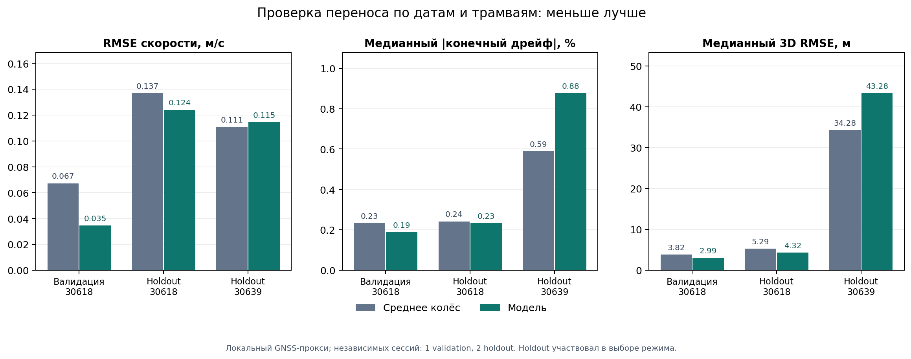

# Аудит качества и риска переобучения

Дата: 27 сентября 2026 г. Все числа ниже — локальная оценка по доступным bag,
**не баллы жюри**. Скрытой объединённой эталонной локализации в наборе нет.

## Вывод

Модель действительно подавляет крупные выбросы и зависания колёс и улучшает
скорость на отдельной валидационной сессии трамвая `30618`. Перенос на другую
дату и трамвай не доказан: на отложенной майской сессии `30639` конечный дрейф
и ошибка 3D-положения хуже простого среднего двух колёс. Говорить «переобучения
нет» по этим данным нельзя. Главный наблюдаемый риск — общий межсессионный
масштаб колесной скорости, который по двум колёсам и команде без внешнего
ориентира неидентифицируем.

## Протокол и чистота разделения

- В каталоге 122 bag, из которых 97 уникальны по SHA-256 SQLite; 25 —
  дубликаты. Дубликаты и полные сессии трамвай/дата не пересекают
  train/validation/holdout ([проверка](../evaluation/audit_stats.md)).
- Разделение содержит 42 уникальных train bag, 13 validation и 42 holdout.
  Но независимых сочетаний трамвай/дата всего **3/1/2** соответственно.
  Все validation bag — `30618` одной даты. Десятки тысяч меток внутри bag
  нельзя выдавать за независимые испытания. Это разделение по сессиям,
  **не прогноз по времени**: в train `30618` есть 3 сентября, позже validation
  26 августа и holdout 10 августа; для `30639` train 26 августа позже
  майского holdout.
- Колесные масштабы, таблица тяги и карта построены на train. Онлайн-оцениватель
  получает лишь три разрешённых входа. GNSS во время прогона используется
  только для начальной выставки, затем — отдельными оценочными скриптами.
- Начало внутренней ENU-системы карты записано по первому GNSS-fix validation
  bag. Это формально нарушение чистоты split в координатном калибре: при
  согласованной замене начала все точки только поворачиваются/переносятся.
  Геометрия пути при этом построена из train, а выдаваемый MGRS переводится
  в фиксированный `37UCB`. Отдельный [аудит происхождения](../analysis/audit_session_reference.json)
  сохраняет факт для воспроизведения.
- Есть **утечка выбора модели в holdout**: после его просмотра выбрано включать
  таблицу привода для `30618` и отключать для `30639`; часть параметров
  позиционного прокси тоже просматривалась на holdout. Поэтому приведённый
  holdout пригоден для диагностики, но не является нетронутым финальным тестом
  процедуры выбора. Validation также использовалась для разработки порогов и
  выбора алгоритма: она является development-сессией, а не окончательным
  слепым тестом. Новой настройки по этим наборам этот аудит не делает.
- GNSS-скорость — прокси: master/rover на метках с точностью 0,05 с усредняются
  лишь при согласии до 0,3 м/с, иначе метка не оценивается; если доступен один
  приёмник, берётся он. В holdout пригоден только 23 из 42 bag. Эта выборка
  может быть смещена относительно всех проверочных условий: у `30618`
  скорость оценена по GNSS лишь на 13/32 bag, положение — на 11/32;
  у `30639` скорость на 10/10, положение на 9/10.

## Основные результаты

База — причинное среднее свежих двух колёс на **тех же временных метках**.
Финальный режим — физическая модель с train-only таблицей для `30618`, без
таблицы для `30639`. Подробные per-bag строки и пересчёт —
[`audit_stats.md`](../evaluation/audit_stats.md) и `*_deployed.csv`.
Конечный дрейф ниже вычислен относительно интеграла доступной GNSS-скорости
на общих непрерывных интервалах (`dt≤0,15 с`), а не относительно истинной
длины рельса; bag с большими разрывами не получают эту метрику.

| Выборка | Скорость, pooled RMSE база → модель | Победы по bag | Медиана абсолютного конечного дрейфа база → модель | 3D RMSE `base_link`, медиана база → модель |
|---|---:|---:|---:|---:|
| Validation `30618` | 0,0672 → **0,0345 м/с** | 12/13 | 0,233 → **0,188%**, 10/12 побед | 3,82 → **2,99 м**, 8/13 побед |
| Holdout `30618` | 0,1369 → **0,1241 м/с** | 10/13 | 0,242 → **0,233%**, 7/11 побед | 5,29 → **4,32 м**, 4/11 побед |
| Holdout `30639` | **0,1108** → 0,1145 м/с | 3/10 | **0,589** → 0,876%, 0/10 побед | **34,28** → 43,28 м, 0/9 побед |
| Holdout вместе | 0,1241 → 0,1192 м/с | 13/23 | **0,340** → 0,664% | **18,28** → 22,28 м |

Общее улучшение RMSE скорости на holdout мало: −0,0049 м/с;
bag-bootstrap для разницы включает ноль (95%: −0,0103…+0,0001).
Этот bootstrap ресэмплирует bag одной даты и **не оценивает** точность на
новой сессии. Медианы 3D — по bag и не заменяют долю побед: например,
`30618` на holdout имеет меньшую маргинальную медиану при всего 4/11
парных победах.

Обучающая сессия `30639` августа даёт RMSE 0,0504 м/с, майский holdout —
0,1145 м/с. На майском holdout bias модели +0,0420 м/с. Сентябрьская
обучающая сессия `30618` сама заметно отличается от июльской: RMSE модели
0,0890 против 0,0561 м/с, bias −0,0485 против −0,0067 м/с. Train здесь
служит описанием гетерогенности, а не оценкой обобщения.

## Проверки против удобного, но ошибочного объяснения

1. **Зависимость от GNSS-приёмника.** На holdout `30639` ухудшение скорости
   остаётся при `dual_agree` (0,1064→0,1098 м/с), отдельно master
   (0,1613→0,1640) и rover (0,1302→0,1336). На validation выигрыш остаётся
   во всех трёх вариантах ([полная таблица](../evaluation/audit_reference.md)).
   Это снижает вероятность, что вывод создан только правилом усреднения двух
   приёмников, но общая ошибка обоих GNSS всё ещё возможна.
   Сравнение с фиксированными wheel-only альтернативами на тех же метках
   даёт для validation `30618`: модель 0,0345, защищённое слияние 0,0608,
   front-only 0,0630 м/с. На holdout `30639` модель 0,1145 лучше
   защищённого слияния 0,1215 и одиночных каналов, однако обычное среднее
   0,1108 остаётся лучше модели
   ([сильные базы](../evaluation/audit_wheel_baselines.md)).
2. **Общий колесный масштаб.** Оценка GNSS/среднее колесо на чистых движущихся
   участках: `30618` июль 1,00011, сентябрь 1,01063; `30639` август
   1,00338, май 0,99145. p95 разности скоростей master/rover по датам
   0,051–0,058 м/с. Независимая проверка интеграла GNSS-скорости против
   геометрической длины общей части карты близка к 1,000 в обеих датах
   ([scale](../evaluation/audit_scale.md),
   [геометрия](../analysis/audit_gnss_speed_geometry.json)). Гипотеза
   изменения эффективного колесного масштаба согласуется с данными; причины
   изменения и истинный масштаб без независимого эталона не установлены.
3. **Нелинейная таблица.** Парная абляция только на `30618`: физическая модель
   → та же модель с train-only таблицей даёт RMSE 0,0359→0,0345 на validation
   и 0,1251→0,1241 на holdout; 12/13 и 9/13 bag выигрывают. Улучшение
   реальное, но невелико в обычном движении. При искусственном обрыве обеих
   тележек на 5 с validation тест того же C++ ядра дал 0,672→0,555 м/с
   физика→таблица; это стресс-тест на выбранных чистых окнах, не гарантия
   произвольного отказа. На holdout `30618` при 211 таких окнах физика→таблица
   даёт 0,714→0,658 м/с. Гипотетическое включение таблицы для `30639` в 231
   чистом окне дало 0,838→0,640 м/с, но в production таблица для него
   отключена: у `30639` нет отдельной validation-сессии, а выбор режима по
   этому holdout был бы дополнительной утечкой
   ([стресс-тест](../evaluation/audit_blackout_summary.md),
   [методика](DRIVE_CALIBRATION.md)).
   В естественных `model_only` эпизодах `30639` есть лишь 153 GNSS-метки,
   почти все в первую секунду, и таблица сработала всего на 2% из них.
   Поэтому искусственный пятисекундный тест не подтверждён естественным
   отказом такой длительности
   ([натуральные эпизоды](../evaluation/audit_natural_model_only.md)).
4. **Возмущения.** На `30618_33bec73f` при 103 метках с флагом скольжения
   RMSE 1,149→0,597 м/с; на `30639_3b3d9eb8` при 28 таких метках
   0,503→0,085 м/с. В последнем bag задний датчик выдавал 151 нулевой
   отсчёт за 45,3 с движения и затем молчал ещё 73,5 с. Во время этого
   эпизода модель помогала (0,103→0,082 м/с), но первые 5 с после возврата
   датчика были хуже базы (0,120→0,155 м/с).
   Флаги отмечают редкую подвыборку, поэтому цифры не описывают всю поездку
   ([инциденты](../evaluation/audit_incidents.md)).
5. **Координаты и эталон позиции.** Официальный пример `37UCB` и перенос
   master→`base_link` по TF проверены. Офлайн-метрика читала до трёх первых
   GNSS-fix раньше, чем мог бы опубликовать позицию ROS; исключение этих
   ранних точек меняет RMSE bag не более чем на 0,009 м. Замена шумной
   3D-разности высот антенн в прокси на `master_z−3` меняет медиану
   `30639` лишь 43,28→43,33 м: не она объясняет провал. Майские GNSS-fix
   имеют медианное смещение высоты около 6,15 м относительно train-карты;
   и этот прокси **не** равен скрытой объединённой локализации жюри
   ([аудит](../evaluation/audit_position_vertical.json)).
   На 9 майских bag общий 3D RMSE по всем точкам 46,37 м, из которых
   XY 45,45 м, продольная проекция 44,26 м, поперечная 8,05 м.
   На трёх bag с почти непрерывной GNSS-скоростью диагностическая замена
   **задним числом** интеграла пути на её интеграл снижает медианный 3D RMSE
   43,30→21,65 м; даже проекция каждой GNSS-позиции на карту оставляет
   12,47 м. Это указывает на существенный вклад масштаба пути, но остаток
   включает карту, ветку и GNSS-позиции; остальные шесть bag не подходят
   для такого контрфакта из-за разрывов GNSS
   ([разложение](../evaluation/audit_30639_position_components.json)).

## Корректность реализации и воспроизводимость

- Обнаружена и исправлена ошибка порядка сообщений контроллера: более старый
  `header.stamp` теперь не может переписать новую позицию после продвижения
  состояния. Новый C++ regression test падает на старой реализации и проходит
  на исправленной. В 97 уникальных bag найдено 60 старых или равных штампов среди
  2,07 млн команд; все потенциально затронутые validation/holdout bag
  перепроверены старым и новым C++ ядром, общие выходы и RMSE совпали
  ([аудит времени](../evaluation/audit_command_timing.md)).
- Отдельно проверены скачки заголовков примерно на секунду вперёд. В двух
  holdout bag `30618` это оказались **наложенные временные потоки** команд
  и колёс, а не одиночный испорченный пакет: более новая ветка продолжается.
  Наивный запрет «команда не более чем на 0,5 с впереди колеса» уменьшил
  число выходов `30618_40ffd323` с 25 538 до 1 707 и
  `30618_2255aade` с 25 060 до 3 934. Получившееся снижение RMSE было
  артефактом пропавших меток. Этот экспериментальный запрет **отменён**;
  финальный фильтр сохраняет более новую ветку. При настоящем одиночном
  future-header без второго потока отдельная защита пока не доказана.
- Исправлено масштабирование `Odometry.twist.linear.x` и позиционных/скоростных
  ковариаций при нестандартном `output_scale`; при штатном `output_scale=1`
  численные результаты не меняются.
- До аудита ковариация пути учитывала короткий шум фильтра, но пропускала
  **общую ошибку масштаба двух колёс**, накапливающуюся с дистанцией.
  В опубликованную продольную ковариацию добавлено
  `(0,01 × путь_после_якоря)²` по train-only межсессионному сдвигу.
  При приближённой проверке на 38 длинных train bag 36 конечных ошибок
  GNSS-интеграла укладываются в один такой диагностический σ, все 38 — в два;
  на 12 validation bag — 12 в один. Положительный внутренний `P_s` при
  этом **опущен**, так что проверка использует нижнюю границу новой
  дисперсии. Это не калиброванный вероятностный интервал и не учитывает
  неправильную ветку карты; точечные v/s/xyz не изменены
  ([скрипт и числа](../evaluation/covariance_scale_audit.json)).
- Старые файлы `evaluation/*_final.csv` содержат результаты **до** исправления
  зависания колеса и не являются текущими метриками. В релиз включаются
  `*_deployed.csv`, исходные варианты модели и аудит; устаревшие таблицы
  исключены из списка публикации.
- Проверка реальной ROS-ноды на полном 263-секундном bag `30618` уже дала
  20,2 Гц, p95 от входа в callback до публикации 0,215 мс и скорость
  ROS↔standalone C++ RMSE 0,00273 м/с. Эти цифры не измеряют полный путь
  датчик→DDS→потребитель; одна поездка не доказывает долгую надёжность
  ([отчёт](RESULTS.md)). Полный 20-минутный replay проблемного
  `30639_3b3d9eb8` тоже прошёл: 21,3 Гц, пик RSS 25,3 МиБ, без аварий;
  ROS↔C++ RMSE 0,00335 м/с на 24 314 общих метках. Но его ROS-скорость
  относительно GNSS-прокси имеет RMSE 0,2233 м/с, а 3D-положение 38,11 м:
  корректное исполнение кода не устраняет межсессионную ошибку масштаба
  ([числа](../evaluation/ros_smoke/anchored_20260927_000129_myd6/accuracy.json)).
- После диагностического исправления ковариации обновлённый ROS-пакет заново
  собран стандартным `colcon build --packages-up-to tram_odometry` на Humble.
  Короткий [replay](../evaluation/ros_smoke/anchored_20260927_003136_Gg9N/report.json)
  дал 305 сообщений скорости и 302 положения, обе темы >20 Гц,
  конечные ковариации и диагностический `wheel_common_scale_sigma=0.01`.

Пересчёт из корня проекта: `python3 evaluation/audit_stats.py --verify-files`.
Числа первичных вариантов доступны в `evaluation/*_rawfreeze_fix.csv` и
`evaluation/*_table_optional.csv`; скрипты `evaluation/audit_reference.py`,
`evaluation/audit_scale.py`, `evaluation/audit_incidents.py` и
`analysis/audit_session_reference.py` повторяют независимые срезы при наличии
распакованного `dataset/data`. Пакет ROS при сборке не требует Python-модулей
этих офлайн-исследований.

## Что требуется для надёжного переноса

Нельзя подогнать майский масштаб `30639` по отложенной GNSS-разметке и затем
назвать эти же bag независимой проверкой. Для снятия неидентифицируемости
нужен другой источник пути: известные остановки/путевые landmarks, надёжная
периодическая привязка основного контура или независимый датчик. До такого
сигнала правильнее явно расти ковариацией пути и сообщать потребителю о
неопределённости. Для выбора западной ветки, расходящейся примерно на 60 м,
нужно маршрутное задание или сигнал стрелки: три скалярных входа её не
определяют. Текущая фиксированная поперечная дисперсия на карте не описывает
всю неопределённость неправильной ветки: её σ≈3 м, тогда как train-карты A/B
в исходящем направлении расходятся на 23,2 м при `s=5450` и на 60,2 м между
конечными точками. Для обратного направления отдельно наблюдались другие
стартовые линии, также не покрытые этой ковариацией. Потребитель должен учитывать
неизвестную ветку отдельно. Полноценную внешнюю оценку следует проводить по
новым датам и обоим трамваям, заранее заморозив код и параметры.
