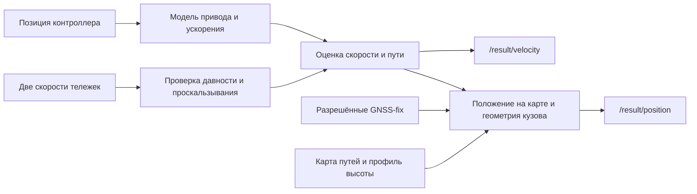

# Математическая модель

## Структура



GNSS-fix уточняют только положение. GNSS-скорость и `/localization/kinematic_state` не входят в рабочий оцениватель. Общее C++-ядро используется ROS-нодой и offline replay.

## Входы и состояния

| Входной топик | Тип / поле | Использование |
|---|---|---|
| `/vehicle/driver_position_cmd` | `tram_vehicle_msgs/msg/DriverControllerCommand`, `position` | Позиция контроллера `n` от −15 до +15 |
| `/vehicle/front_bogie_velocity` | `tram_vehicle_msgs/msg/VelocitySensor`, `velocity` | Скорость передней тележки |
| `/vehicle/rear_bogie_velocity` | Тот же тип и поле | Скорость задней тележки |
| `/sensing/gnss/master/fix` | `sensor_msgs/msg/NavSatFix` | Стартовая привязка и разрешённые поправки |
| `/sensing/gnss/rover/fix` | Тот же тип | Запасная привязка, курс пары и поправки |

Все расчёты используют `header.stamp`. Значения колёс в предоставленных bag фактически выражены в км/ч: `w_i = raw_i × scale_i / 3.6`. Внутри ядра применяются СИ: скорость `v` — м/с, путь `s` — м, ускорение `a` — м/с². Дополнительные состояния: запаздывающая команда привода `q`, медленная поправка ускорения `b`, дисперсии скорости/пути и состояние исправности колёс.

## От команды и момента к ускорению

Здесь `clip(x,l,h)` ограничивает x диапазоном [l,h]. Команда проходит через апериодическое звено:

```text
u = n / 15
q_next = q + (u − q) · (1 − exp(−Δt / τ))
τ = 0.27 с при u < q; иначе 0.45 с
```

Если команда не обновляется более 1 с, `u=0`. Для положительной тяги:

```text
F_torque(v) = (N · T_max · i · η / r) / (1 + (v / v_rolloff)²)
F_power(v)  = P_max / max(v, 1.5)
F(q,v)     = q^0.75 · min(F_torque(v), F_power(v)), q > 0
```

Для торможения и нейтрали:

```text
F(q,v) = −B_max · |q|^0.72 · (0.5 + 0.5 · clip(v/1.5, 0, 1)), q < 0
F(0,v) = 0
a_physics = clip(F/m − d(v) + a_grade + b, −4, 3)
d(v) = a_roll + k_drag · v² при v > 0.05; иначе 0
```

`N=4` — число приводных осей, `i=6` — передаточное число, `η=0.84` — КПД, `v_rolloff=23 м/с`. `T_max` — момент одного двигателя, `r` — эффективный радиус колеса, `m` — масса; их значения приведены в [параметрах](PARAMETERS.md). Это приближённая модель привода: реальный момент двигателя во входах отсутствует.

Для 30618 добавляется обученная на train таблица ускорений по позиции ручки и интервалу скорости:

```text
λ = clip((0.75 − σ_table)/0.55, 0, 1) · (1 − exp(−dwell/0.5))
a_model = clip(a_physics(q,v) + λ · [a_table(n,v) − (a_physics(n/15,v) − b)], −4, 3)
```

`dwell` — время после смены команды; `σ_table` — неопределённость ячейки. Между поддержанными соседними интервалами используется линейная интерполяция. За пределами 1–20 м/с, без ячейки или при отсутствии таблицы остаётся физическая модель. Для 30639 таблица по умолчанию отключена.

## Прогноз и коррекция по колёсам

```text
v_pred = clip(v + a_prop · Δt, 0, 25)
s_pred = s + (v + v_pred) · Δt / 2
P_v_pred = P_v + (σ_a · Δt)²
```

Обычно `a_prop=a_model`. При пропуске обоих здоровых колёс используется кратковременный остаток недавнего колёсного ускорения: `a_prop=clip(a_model + w·a_residual, −4, 3)`, где `w=exp(−max(0, age−0.35)/0.35)`. Обнаруженный отказ сбрасывает этот остаток.

Измерения проверяются по возрасту, порядку меток, скачкам, расхождению тележек и отклонению от прогноза. Для принятого колеса:

```text
R = (σ_w · c)²; c=1 при доступном втором колесе, иначе 1.3
K = 0.90 для согласованной пары / её подтверждённого восстановления
K = clip(P_v_pred / (P_v_pred + R), 0.40, 0.88) в остальных случаях
v_new = clip(v_pred + K · innovation, 0, 25)
P_v_new = max(10⁻⁵, (1−K) · P_v_pred)
```

Большая инновация одиночного колеса ограничивается ±0,8 м/с. Путь получает половину поправки скорости, умноженную на интервал после последнего принятого колеса (не более 0,25 с); прежние выходы не переписываются. Согласованная остановка закрепляет `v=0`.

Ускорение по исправным колёсам оценивается разностью `Δw/Δt`. При устойчивой команде и согласии тележек медленно обновляется `b ← clip(b + 0.035·Δt·(a_wheel−a_model), −0.25, 0.25)`. В диагностике отдельно доступны модельное и оценённое ускорение.

При общем точном зависании после наблюдаемого разгона/торможения оба колеса исключаются. Одна лишь смена ручки не является признаком отказа. После восстановления возможна ограниченная компенсация пути до ±5 м, распределённая по следующим выходам; любая смена команды во время зависания запрещает эту компенсацию. Скалярное обновление с защитами не является полным EKF.

## От пути к положению

Карта хранит координаты траектории master в ENU, параметризованные пройденным расстоянием. После стартовой привязки используется `s_map=s_start+s`; направление выбирается из `out/return`, альтернативная ветка — по устойчивой серии разрешённых fix.

Положение `base_link` получается из точки карты добавлением плеча master→base вдоль направления кузова и стартового остатка XY. Остаток и поправка стартового курса затухают как `exp(−Δs/100 м)`. При rover-привязке оба антенных плеча поворачиваются согласованно. Геометрия в `base_link`: master `(-9.873,0,3)` м, rover `(2.563,0,3)` м.

После проверок GNSS применяется ограниченная поправка продольного якоря: `Δs_start=clip(0.5·median(innovation), −3, 3)` м по окну из трёх fix. Скорость и накопленный путь от GNSS не меняются.

Выходной кадр — фиксированный `37UCB`: `x=UTM37N.E−300000`, `y=UTM37N.N−6100000`. Высота `base_link` на покрытом участке берётся из официального Pathgraph, вне него — из карты с поправкой высоты антенны −3 м. Без привязки по умолчанию используется относительный кадр `odom` с заданными начальной точкой и курсом.

Исходники: [Estimator](../../ros2_ws/src/tram_odometry/src/estimator.cpp), [Navigation](../../ros2_ws/src/tram_odometry/src/navigation.cpp), [ROS-нода](../../ros2_ws/src/tram_odometry/src/odometry_node.cpp).
