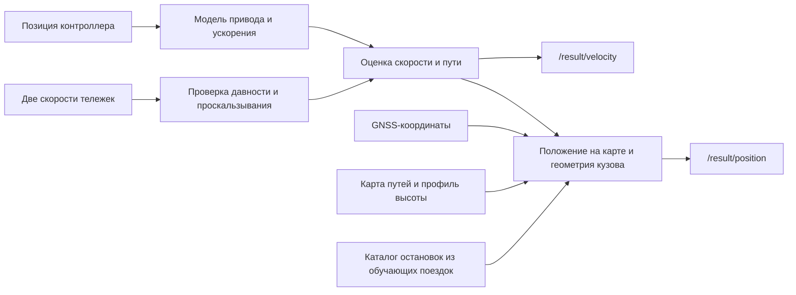

# Математическая модель

## Структура



GNSS-координаты уточняют положение. Скорость оценивается по контроллеру и датчикам тележек. GNSS-скорость и `/localization/kinematic_state` используются при проверке точности. Общее C++-ядро используется ROS-нодой и при офлайн-пересчёте.

## Входы и состояния

| Входной топик | Тип / поле | Использование |
|---|---|---|
| `/vehicle/driver_position_cmd` | `tram_vehicle_msgs/msg/DriverControllerCommand`, `position` | Позиция контроллера `n` от −15 до +15 |
| `/vehicle/front_bogie_velocity` | `tram_vehicle_msgs/msg/VelocitySensor`, `velocity` | Скорость передней тележки |
| `/vehicle/rear_bogie_velocity` | Тот же тип и поле | Скорость задней тележки |
| `/sensing/gnss/master/fix` | `sensor_msgs/msg/NavSatFix` | Стартовая привязка и поправки |
| `/sensing/gnss/rover/fix` | Тот же тип | Запасная привязка, курс пары и поправки |

Все расчёты используют `header.stamp`. Значения колёс в предоставленных записях фактически выражены в км/ч: `w_i = raw_i × scale_i / 3.6`. Внутри ядра применяются СИ: скорость `v` — м/с, путь `s` — м, ускорение `a` — м/с². Дополнительные состояния: запаздывающая команда привода `q`, медленная поправка ускорения `b`, дисперсии скорости/пути и состояние исправности колёс.

## От команды и момента к ускорению

Здесь `clip(x,l,h)` ограничивает x диапазоном [l,h]. Команда проходит через апериодическое звено:

```text
u = n / 15
q_next = q + (u − q) · (1 − exp(−Δt / τ))
τ = 0.27 с при u < q
τ = 0.45 с в остальных случаях
```

Если команда не обновляется более 1 с, `u=0`. Для положительной тяги:

```text
F_torque(v) = (N · T_max · i · η / r) / (1 + (v / v_rolloff)²)
F_power(v)  = P_max / max(v, 1.5)
F(q,v)     = q^0.75 · min(F_torque(v), F_power(v)), q > 0
```

Для торможения и нейтрали:

```text
F(q,v) = −B_max · |q|^0.72 · (0.5 + 0.5 · clip(v/1.5, 0, 1)), q < 0
F(0,v) = 0
a_physics = clip(F/m − d(v) + a_grade + b, −4, 3)
d(v) = a_roll + k_drag · v² при v > 0.05
d(v) = 0 в остальных случаях
```

`N=4` — число приводных осей, `i=6` — передаточное число, `η=0.84` — КПД, `v_rolloff=23 м/с`. `T_max` — момент одного двигателя, `r` — эффективный радиус колеса, `m` — масса. Их значения приведены в [параметрах](PARAMETERS.md). Тяговое усилие оценивается по положению контроллера, характеристикам привода и скорости.

Для 30618 добавляется построенная по обучающей выборке таблица ускорений по позиции ручки и интервалу скорости:

```text
λ = clip((0.75 − σ_table)/0.55, 0, 1) · (1 − exp(−dwell/0.5))
a_model = clip(a_physics(q,v) + λ · [a_table(n,v) − (a_physics(n/15,v) − b)], −4, 3)
```

`dwell` — время после смены команды. Величина `σ_table` — неопределённость ячейки. Между поддержанными соседними интервалами используется линейная интерполяция. Для 30618 физическая модель дополнена калибровочной таблицей в диапазоне 1–20 м/с. В остальных режимах, при недоступной ячейке таблицы и для 30639 используется физическая модель.

## Прогноз и коррекция по колёсам

```text
v_pred = clip(v + a_prop · Δt, 0, 25)
s_pred = s + (v + v_pred) · Δt / 2
P_v_pred = P_v + (σ_a · Δt)²
```

Обычно `a_prop=a_model`. При пропуске обоих здоровых колёс используется кратковременный остаток недавнего колёсного ускорения: `a_prop=clip(a_model + w·a_residual, −4, 3)`, где `w=exp(−max(0, age−0.35)/0.35)`. Обнаруженный отказ сбрасывает этот остаток.

Измерения проверяются по возрасту, порядку меток, скачкам, расхождению тележек и отклонению от прогноза. Для принятого колеса:

```text
R = (σ_w · c)²
c=1 при доступном втором колесе, иначе 1.3
K = 0.90 для согласованной пары / её подтверждённого восстановления
K = clip(P_v_pred / (P_v_pred + R), 0.40, 0.88) в остальных случаях
v_new = clip(v_pred + K · innovation, 0, 25)
P_v_new = max(10⁻⁵, (1−K) · P_v_pred)
```

Большое отклонение показания одного колеса от прогноза ограничивается ±0,8 м/с. Путь получает половину поправки скорости, умноженную на интервал после последнего принятого колеса (не более 0,25 с). Поправка применяется к текущему и последующим результатам. Согласованная остановка закрепляет `v=0`.

Ускорение по исправным колёсам оценивается разностью `Δw/Δt`. При устойчивой команде и согласии тележек медленно обновляется `b ← clip(b + 0.035·Δt·(a_wheel−a_model), −0.25, 0.25)`. В диагностике отдельно доступны модельное и оценённое ускорение.

При общем точном зависании оба колеса исключаются из коррекции. Детектор учитывает свежесть и согласованность показаний, длительность плато и ожидаемое ускорение. Дополнительным признаком служит предшествующий разгон/торможение по колёсам либо плато, начавшееся до сильной команды торможения. Во втором случае нужны `n≤−5` дольше 0,8 с и модельное ускорение ниже −0,4 м/с².

После восстановления возможна компенсация пути до ±5 м, распределённая по следующим выходам. Компенсация применяется при неизменной команде в течение зависания.

## От пути к положению

Основная антенна обозначается `master`, вторая — `rover`. Карта хранит координаты траектории основной антенны в ENU, параметризованные пройденным расстоянием. После стартовой привязки используется `s_map=s_start+s`. Направление выбирается из `out/return`. Альтернативная ветка определяется по устойчивой серии согласованных GNSS-измерений.

Для западной развилки предусмотрено дополнительное правило выбора ветки по движению:

| Условие | Значение |
|---|---|
| Область действия | 30618, направление `out`, стартовая GNSS-привязка, обе карты с ожидаемой геометрией |
| Координата вдоль маршрута | `5395 < s_map < 5402` м |
| Движение | Скорость >4 м/с и положение контроллера ≥10 |
| Колёса | Оба канала свежие, признаки проскальзывания отсутствуют |
| Подтверждение | Условия сохраняются ≥0,2 с, возраст последнего GNSS >1 с |
| Результат | Однократный выбор альтернативной ветки A вместо основной B |

При таком выборе положение плавно переходит между картами на протяжении 20 м пути: `w=clip((s−s_switch)/20,0,1)`, `p=(1−w)p_B+w·p_A`. Курс интерполируется по единичным векторам направлений. Правило уточняет координаты и курс.

Положение `base_link` получается из точки карты добавлением плеча от основной антенны до `base_link` вдоль направления кузова и начального смещения относительно карты по X и Y. Начальное смещение и поправка стартового курса затухают как `exp(−Δs/100 м)`. При привязке по второй антенне оба антенных плеча поворачиваются согласованно. Для RTK-привязки курс определяется по согласованной RTK-паре. При запасной привязке без RTK допустима согласованная пара обычных GNSS-измерений. Геометрия в `base_link`: основная антенна `(-9.873,0,3)` м, вторая `(2.563,0,3)` м.

После проверок GNSS применяется ограниченная поправка привязки вдоль маршрута: `Δs_start=clip(0.5·(median(s_anchor)−s_start), −3, 3)` м по окну из трёх измерений GNSS, где `s_anchor=s_GNSS−s`. GNSS-коррекция применяется к привязке положения на карте.

Каталог из 23 типичных остановок уточняет привязку `s_start` для 30618 на основной карте. Он построен по обучающим поездкам. Для коррекции нужны стоянка ≥8 с, хотя бы один свежий колёсный канал и скорость всех свежих каналов ≤0,11 м/с. Оценка скорости должна быть ≤0,2 м/с, команда контроллера — ≤0. Перед стоянкой скорость должна достигнуть 2 м/с. Проверка начинается после первых 60 с и 100 м движения.

Выбирается ближайший неиспользованный маркер того же направления в пределах 12 м. Он должен быть ближе второго кандидата минимум на 6 м. Расстояние от предыдущей коррекции — не менее 30 м. Поправка `Δs_start=0,8·(s_stop−s_map)` применяется, если её модуль ≤10 м. Коррекция изменяет привязку положения на карте.

Выходная система координат — фиксированная `37UCB`: `x=UTM37N.E−300000`, `y=UTM37N.N−6100000`. Высота `base_link` на покрытом участке берётся из официального Pathgraph, вне него — из карты с поправкой высоты антенны −3 м. Без привязки по умолчанию используется относительная система координат `odom` с заданными начальной точкой и курсом.

Исходники: [Estimator](../../ros2_ws/src/tram_odometry/src/estimator.cpp), [Navigation](../../ros2_ws/src/tram_odometry/src/navigation.cpp), [ROS-нода](../../ros2_ws/src/tram_odometry/src/odometry_node.cpp).
