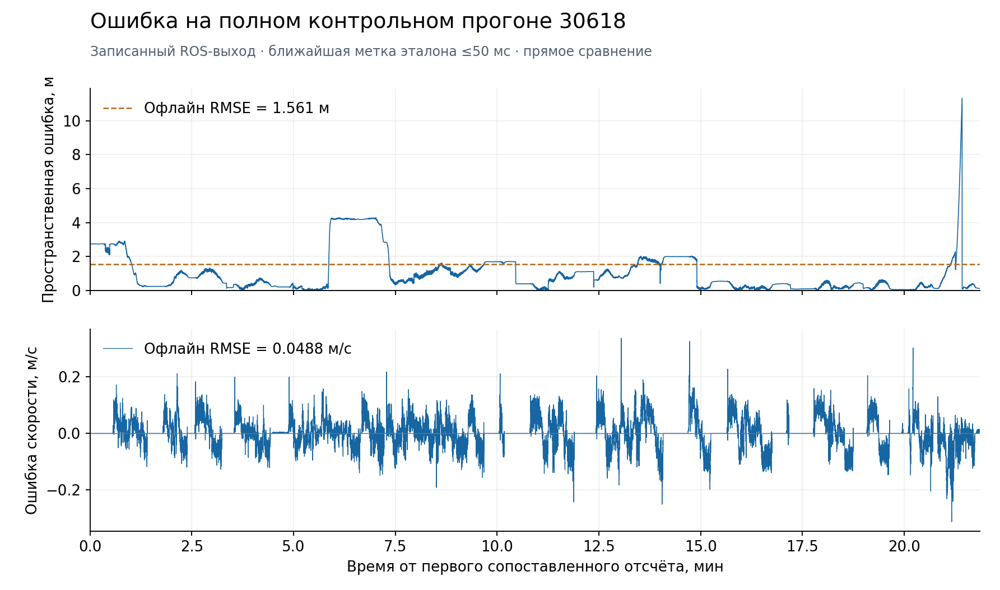

# Точность и быстродействие

**На полном контрольном прогоне: RMSE положения 1,56 м, скорости 0,052 м/с. Частота публикации положения — 21,75 Гц, задержка p95 — 4,39 мс.**

Эти измерения выполнены на коде `8164061` **до** добавления коррекции по остановкам. Новая версия проверена отдельным полным C++ replay на 13 записях validation: при доступности GNSS только в первые 1,5 с суммарный 3D RMSE по GNSS-прокси **3,07993→2,64424 м** на одинаковых 301 243 метках; 8 записей улучшились, 3 ухудшились, 2 не изменились. Скорость не изменилась. При редких поздних GNSS 3D RMSE изменился лишь 1,84099→1,83627 м. Это иной эталон и режим; его нельзя приравнивать к официальному checker. [Методика, все записи и ограничения](../STOP_LANDMARKS_2026-09-27.md).

Официальный контрольный прогон выполнен прямым сравнением координат и скорости в исходной системе координат и по временным меткам сообщений. RMSE — среднеквадратическая ошибка.

## Открытый контрольный прогон

Контрольная запись: `30618_88aea4d9`. Эталон — `/localization/kinematic_state`, выход комплексированной системы. Для положения сравниваются XYZ точки `base_link`, для скорости — `twist.twist.linear.x` эталона.

Официальная проверяющая программа использует ROS `ApproximateTimeSynchronizer`: допуск 50 мс, очередь 100. Для пространственной ошибки берётся евклидова норма вектора ошибки. Полный прогон при скорости воспроизведения 1×. Сопоставлены 28 538 пар для каждого результата.

| Официальная метрика | RMSE | Максимальная ошибка |
|---|---:|---:|
| Положение, пространственная ошибка | **1,561536 м** | 11,309004 м |
| X | 0,812204 м | 8,979361 м |
| Y | 1,331048 м | 6,873523 м |
| Z | 0,083850 м | 0,385468 м |
| Скорость | **0,051795 м/с** | 0,336817 м/с |

[Исходный отчёт](../../evaluation/results/round4/ros_run_summary.json) · [Лог проверки](../../evaluation/results/round4/ros_checker.log).

### Ошибка по времени



График построен по записанному ROS-выходу: каждый результат сопоставлен с ближайшей временной меткой эталона в пределах 50 мс. График показывает все сопоставленные отсчёты полного прогона. При дополнительном офлайн-пересчёте получены RMSE положения **1,560661 м**, скорости **0,048762 м/с**, ошибка конечной позиции **0,123035 м**.

<details>
<summary>Воспроизведение графика</summary>

[Офлайн-метрики](../../evaluation/results/round4/ros_offline_metrics.json) · [Данные воспроизводимости графика](reference_errors.json) · [Скрипт графика](../../tools/make_submission_plot.py).

После повторного прогона:

```bash
python3 -m pip install matplotlib
python3 tools/make_submission_plot.py \
  --bag /absolute/path/to/30618_88aea4d9 \
  --candidate evaluation/runs/jury_check/candidate.csv \
  --metrics evaluation/runs/jury_check/offline_metrics.json
```

</details>

## Проверка по GNSS исходного датасета

97 уникальных записей разделены по целым сессиям «трамвай + дата»: обучающая выборка — 42, валидационная — 13, историческая контрольная — 42. Пересечение дубликатов между выборками исключено. Карта и калибровки построены по обучающей выборке.

Оценка скорости по GNSS для сравнения использует модуль пространственного вектора скорости основной (`master`) и второй (`rover`) антенн и ближайшие показания с допуском 50 мс: при согласии двух скоростей до 0,3 м/с — их среднее, при доступности одного приёмника — его значение. Несогласованные пары исключаются. GNSS-оценка скорости используется для проверки точности.

| Набор | Записей с GNSS-оценкой / всего | Сопоставлений | RMSE скорости |
|---|---:|---:|---:|
| Обучающая выборка, обе машины | 42 / 42 | 939478 | 0,057982 м/с |
| Валидационная выборка, 30618 | 13 / 13 | 286515 | 0,033146 м/с |
| Историческая контрольная выборка, обе машины | 23 / 42 | 431768 | 0,118075 м/с |

Оценка скорости выполнена на 23 из 42 контрольных записей с пригодными GNSS-измерениями.

В 284 одинаковых валидационных окнах удалены сообщения обоих колёс на 5,12 с. Сообщения контроллера продолжают поступать. Эталон пути — интеграл очищенной GNSS-скорости. Ошибка измеряется от начала каждого обрыва:

| Горизонт обрыва | RMSE скорости | RMSE пути |
|---|---:|---:|
| 1 с | 0,134484 м/с | 0,076536 м |
| 3 с | 0,379171 м/с | 0,577486 м |
| 5 с | 0,533883 м/с | 1,466822 м |

Проверка включает сравнение с GNSS и моделирование потери обоих колёсных датчиков.

Дополнительно проверен случай, когда обе тележки продолжают публиковать
одинаковые постоянные значения после начала сильного торможения. Узкий
детектор уменьшил в синтетическом сценарии 30618 RMSE скорости
0,545→0,047 м/с и пути 8,25→0,64 м; на 97 реальных train/validation/исторических
holdout bag прежняя и экспериментальная версии выдали одинаковые результаты.
Этот тест подтверждает реакцию на конкретный отказ и не заменяет официальный
скрытый прогон. [Условия срабатывания и ограничения](../PAIR_FREEZE_BRAKE_2026-09-27.md).

[Разделение записей](../../tools/split_manifest.json) · Исходные измерения: [обучающая выборка](../../evaluation/results/round3/final_speed_train_summary.json), [валидационная](../../evaluation/results/round3/final_speed_validation_summary.json), [контрольная](../../evaluation/results/round3/final_speed_holdout_summary.json).

## Быстродействие

Ubuntu 22.04 / ROS 2 Humble, arm64, Docker с лимитом 2 CPU и 512 MiB. Измерялся только процесс `odometry_node`.

| Показатель | Результат |
|---|---:|
| Средняя частота `/result/position` по временным меткам сообщений | 21,75 Гц |
| Задержка вход→положение, p50 / p95 / max | 1,774 / 4,385 / 27,316 мс |
| Задержка вход→скорость, p50 / p95 / max | 1,166 / 3,937 / 16,495 мс |
| CPU, среднее / p95 | 2,91% / 5,49% одного ядра |
| Пиковая память | 24,64 MiB |

Задержка измерена внешним наблюдателем по монотонным часам между приёмом входного сообщения контроллера или датчика передней/задней тележки и результата с той же меткой. Она включает DDS и планирование наблюдателя. Внутренняя задержка обработчика сообщения публикуется отдельно в диагностике. CPU измерен по `/proc`, 100% означает одно ядро. Память — `VmHWM`. Замеры выполнены при фоновой нагрузке на хосте.

## Проверки поставки

Для предыдущей измеренной версии 19 C++ тестов прошли в сборке без ROS и в Ubuntu/ROS; 40 Python-тестов прошли. Проверены сборка исходников из ZIP, режим без GNSS для 30618 и запуск с привязкой для 30639. [Протокол](../../evaluation/results/round4/verification.json). С новой коррекцией выполнены сборка ROS 2 Humble и **20/20 CTest**, включая отдельный тест отказов и отсутствия карты. [Команды воспроизведения](../JURY_CHECK.md).
